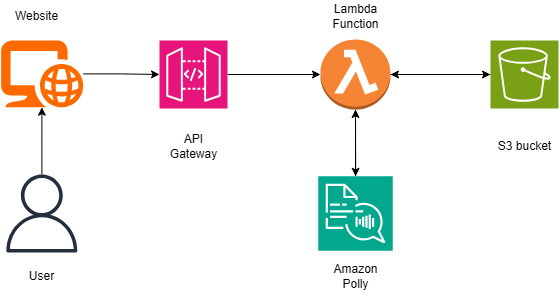

# 🗣 AWS Text-to-Speech Converter

A lightweight web application that converts text to speech using *AWS Polly*, *Lambda*, *S3*, and *API Gateway* — with a clean frontend hosted on *GitHub Pages*. \
Built to showcase real-world AWS skills in serverless, storage, security, and frontend integration.

---

## 🚀 Demo Video

https://github.com/user-attachments/assets/5909b6d0-835a-43de-a743-7f567c5220f4

Type some text, click "Convert", and hear it speak!

---

## 📦 Features

- ✅ Serverless API using *AWS Lambda (Python)*
- ✅ Text-to-Speech powered by *Amazon Polly*
- ✅ Audio stored securely in *Amazon S3*
- ✅ Pre-signed S3 URLs shared via *API Gateway*
- ✅ Frontend with HTML + CSS + JavaScript
- ✅ API protected via *API Key* & *CORS*
- ✅ Publicly shareable audio links
- ✅ Frontend hosted on *GitHub Pages*

---

## 🧱 Architecture

\
Architecture Diagram

---

## 📂 Folder Structure
aws-polly-tts/ \
├── README.md \
├── Architecture_diagram.png \
├── LICENSE \
├── Demo.mp4 \
├── index.html \
├── style/ \
│ &ensp;&ensp;  └── home.css \
├── script/ \
| &ensp;&ensp;   └── app.js 

---

## 📤 Deployment

Backend:

- Lambda function (Python) with Polly + S3 logic
- Exposed via API Gateway
- API Key enabled
- CORS configured
- Pre-signed URLs returned

Frontend:

- HTML/CSS/JS static site
- Hosted via GitHub Pages

---

## 🔐 Security

- ✅ API Gateway secured with *API Key*
- ✅ S3 bucket not public — uses *pre-signed URLs*
- ✅ CORS only for required origin

---

## 💡 Usage

1. Enter text in the input box
2. Click "Convert to Speech"
3. App calls Lambda, gets S3 pre-signed URL
4. Audio plays instantly & link available for download

---

## 🛠 Tech Stack

- *AWS Lambda* 
- *Amazon Polly*
- *Amazon S3*
- *API Gateway*
- *HTML / CSS / JS*
- *GitHub Pages*

---

## 🙌 Acknowledgments

This project was built as a practical showcase after earning:
- AWS Certified Solutions Architect – Associate
- AWS Certified AI Practitioner

---

## 🗨 Want to Chat?

Connect with me on [LinkedIn](https://www.linkedin.com/in/shaunak-shukla/) \
Always happy to discuss serverless, AI, or cloud builds ☁🚀

---
